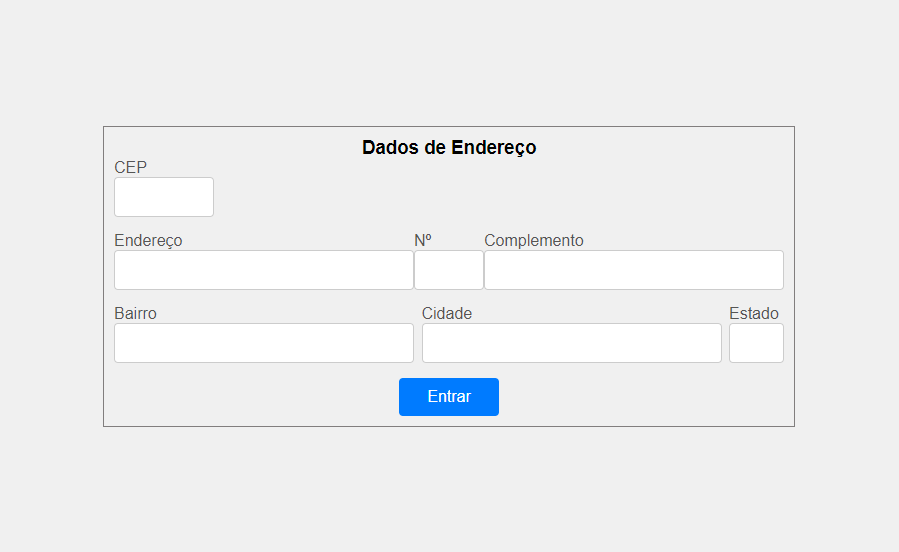

# Form-CadEndereco 🗺️

## 📄 Descrição
 
 Este projeto foi feito durante as aulas de PWI, usamos código em JavaScript, html e css. O JavaScript implementa a funcionalidade de gerenciar a entrada de um CEP (Código de Endereçamento Postal) e interagir com uma API para recuperar informações sobre um endereço. O código HTML define uma página para cadastro de endereço, estruturada de maneira organizada e intuitiva. E o código CSS define estilos para um formulário, visando uma aparência moderna e responsiva. Este projeto permite ao usuário pesquisar e preencher automaticamente dados de endereço com base no CEP fornecido. Ele utiliza a API pública [ViaCEP](https://viacep.com.br/) para obter informações sobre o endereço.

 ## Funcionalidades 

 * Validação de CEP: Verifica se o CEP digitado possui 8 dígitos numéricos.
 * Consumo de API: Realiza uma requisição para a API ViaCEP, recuperando informações como logradouro, bairro, cidade e estado.
 * Preenchimento automático: Preenche os campos do formulário com os dados obtidos da API.

 ## Tecnologias utilizadas 

 * HTML
 * CSS
 * JavaScript (ES6)

 ## Estrutura do Código

  ### JavaScript
* Modo Estrito: O código é executado em modo restrito ('use strict'), o que ajuda a evitar erros comuns e a garantir uma programação mais segura, como evitar a declaração de variáveis sem let, const ou var.
* Recursos principais:
  * const limparFormulário(): Limpa todos os campos do formulário.
  * const eNumero(numero): Verifica se a entrada é um número.
    * /^[0-9]+$/ Expressão regular usada para verificar se uma string contém apenas dígitos (números) de 0 a 9. 
  * const cepValido(cep): Valida se o CEP tem 8 dígitos e se é numérico.
    * && Operador lógico usado na função cepValido para verificar se o CEP tem exatamente 8 caracteres e se todos são dígitos
  * const preencherFormulario(endereco): Preenche os campos do formulário com os dados retornados pela API.
  * const pesquisarCep(): Função assíncrona que consome a API ViaCEP e preenche o formulário ou exibe um alerta se o CEP não for encontrado.
    * A declaração [async](https://developer.mozilla.org/pt-BR/docs/Web/JavaScript/Reference/Statements/async_function) function define uma função assíncrona, que retorna um objeto AsyncFunction.
    * O evento [focusout](https://developer.mozilla.org/pt-BR/docs/Web/API/Element/focusout_event) é acionado assim que o elemento perde o foco. A principal diferença entre esse evento e o evento blur, é que esse ultimo não gera "borbulhas". Você também pode definir funções assíncronas usando uma expressão async function.
    * A API [Fetch](https://developer.mozilla.org/pt-BR/docs/Web/API/Fetch_API/Using_Fetch) fornece uma interface JavaScript para acessar e manipular partes do pipeline HTTP, tais como os pedidos e respostas. Ela também fornece o método global fetch() que fornece uma maneira fácil e lógica para buscar recursos de forma assíncrona através da rede.
    * [await](https://developer.mozilla.org/pt-BR/docs/Web/JavaScript/Reference/Operators/await) é utilizado para esperar por uma Promise. Ele pode ser usado apenas dentro de uma async function.
    * [hasOwnProperty()](https://developer.mozilla.org/pt-BR/docs/Web/JavaScript/Reference/Global_Objects/Object/hasOwnProperty) retorna um booleano indicando se o objeto possui a propriedade especificada como uma propriedade definida no próprio objeto em questão (ao contrário de uma propriedade herdada).
    * [addEventListener()](https://developer.mozilla.org/pt-BR/docs/Web/API/EventTarget/addEventListener) registra uma única espera de evento em um único alvo. O alvo do evento pode ser um único elemento em um documento, o documento em si, uma janela, ou um XMLHttpRequest.

  ### HTML 

 * Um formulário simples que coleta informações de endereço.
 * Campos para inserir o CEP, logradouro, número, complemento, bairro, cidade e estado.
 * Um botão de submissão para enviar os dados.

 ## Como usar 

 1. Abra o link [for.html](https://anacenali.github.io/form-CadEndereco-/for.html) em um navegador web.
 2. Digite um CEP válido no campo correspondente e pressione Tab ou clique fora do campo para ativar a pesquisa.
 3. Os campos de endereço serão preenchidos automaticamente com os dados correspondentes ao CEP inserido.
 

 ## Imagens do site 
 
 ## GIF funcionamento do site
 

 ## Referências 

 * [ViaCEP](https://viacep.com.br/)
 * [Markdown Cheatsheet](https://github.com/adam-p/markdown-here/wiki/Markdown-Cheatsheet)
 * [Leonardo Rocha](https://github.com/leonardossrocha)
 * [Developermozilla](https://developer.mozilla.org/pt-BR/)